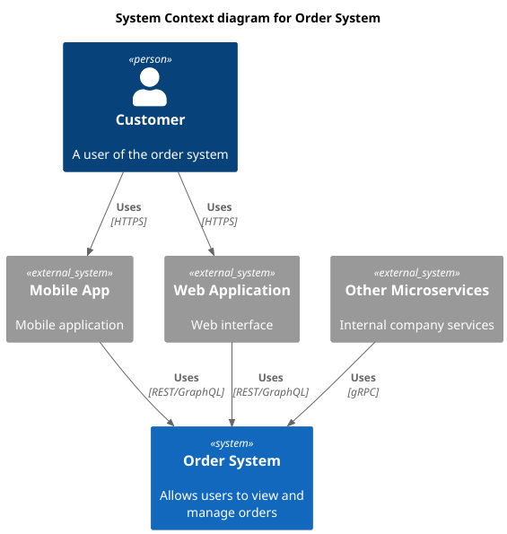

# Serviço de Pedidos

Arquitetura de microsserviços para gestão de pedidos fornecendo interfaces REST, GraphQL e gRPC.

## Arquitetura

Este projeto segue o Modelo C4 para documentação da arquitetura. Visualize os diagramas em `/docs/c4`:

- [Contexto](./docs/c4/context.png) - Visão geral do sistema e interações externas
- [Container](./docs/c4/container.png) - Componentes técnicos e seus relacionamentos
- [Componente](./docs/c4/component.png) - Estrutura interna e organização
- [Código](./docs/c4/code.png) - Classes e interfaces principais

| Contexto                           | Container                             | Componente                             | Código                        |
|------------------------------------|---------------------------------------|----------------------------------------|-------------------------------|
|  |  |  |  |

## Serviços

- API REST: `:8080`
- GraphQL: `:8081`
- gRPC: `:50051`

## Início Rápido

```bash
# Iniciar todos os serviços
docker compose up -d

# Verificar status dos serviços
docker compose ps
```

## Documentação da API

Antes de iniciar as requisições para listar as ordens é importante que você execute pelo menos uma única vez a requisição HTTP para criar uma nova ordem. 

Use o seguinte comando no terminal ou execute o arquivo `tests/http/create_order.http` em sua IDE (se for compatível).

```bash
curl -X POST "http://localhost:8080/order" \
-H "Content-Type: application/json" \
-d '{
  "customer_id": "550e8400-e29b-41d4-a716-446655440000",
  "status": "pending",
  "total_amount": 150.50
}'
```


### Endpoints REST

Use este comando para executar a requisição diretamente no Terminal, ou use o arquivo `.http` que está na pasta `tests/http/rest_list_orders.http`.

```bash
curl -X GET "http://localhost:8080/order" -H "Accept: application/json"
```

### GraphQL

Use esta consulta para listar as ordens através do GraphQL, ou use o arquivo `.http` que está na pasta `tests/http/graphql_list_orders.http`.

```graphql
query {
  listOrders {
    id
    customerId
    status
    totalAmount
  }
}
```

### gRPC

Um cliente adicional foi desenvolvido para listar as ordens através do gRPC, você pode executá-lo usando o seguinte comando.

```bash
go run tests/grpc/client.go
```

```protobuf
service OrderService {
    rpc ListOrders(ListOrdersRequest) returns (ListOrdersResponse);
}
```

## Estrutura do Projeto
```
.
├── api/          # Definições de API
├── cmd/          # Pontos de entrada dos serviços
├── internal/     # Código privado da aplicação
├── migrations/   # Migrações do banco de dados
├── tests/        # Testes
└── docs/         # Documentação
```

## Requisitos

- Go 1.23+
- Docker & Docker Compose
- PostgreSQL (fornecido via Docker)
